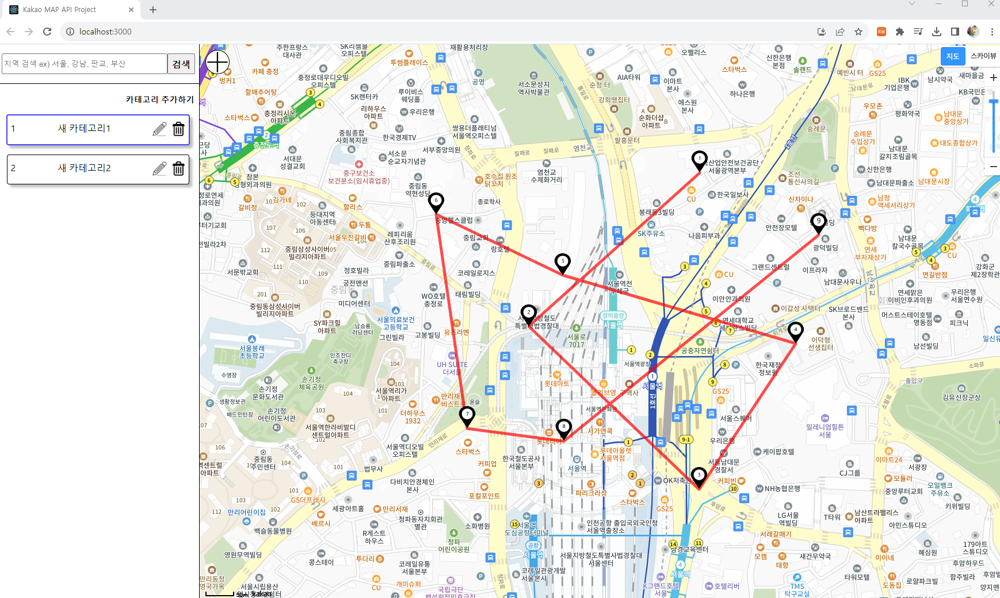

# KakaoMarkerTrace

<h2>1. 간략 설명</h2>
카카오 맵 API를 사용하여, 지도에 마커와 줄을 표시할 수 있으며, Recoil 상태 관리를 이용하여 사이드바에 항목 별로 체크할 수 있는 기능을 사용할 수 있게 설정하였습니다.
그리고 지도의 좌측 상단의 + 버튼을 클릭하여 마지막 마커를 기준으로 상하좌우를 선택 후 거리를 입력하여 마커를 출력할 수 있습니다.

<h2>2. 사용 기술</h2>

<h4>Kakao MAP API</h4>

<h2>3. 셋팅</h2>
<h3>frontend/.env</h3>
REACT_APP_KAKAO_MAP=####   

<h3>4. 실행</h3>

cd frontend 
npm run start

<h3>5. 샘플 사진</h3>

;

